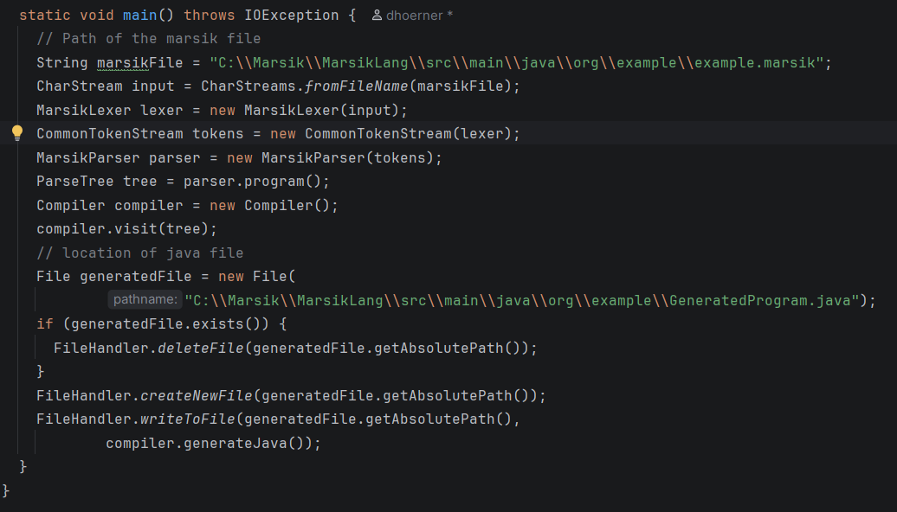

# Marsik 🐾

An experimental programming language.

## Philosophy

- No complicated syntax like C++
- No out-of-control overhead like Python
- Simple and powerful like Python
- As intuitive as possible

## Features

- Primitive types: `int`, `double`, `char`, `boolean`, `string` (pretends to be)
- Static standard libraries: `Math`, `Sys`, `Crypto`, `FileHandler`, `DateTime`, `Validator`
- Variables, constants, operators, control flow, primitive arrays, and built-in data structures
- Compiles from `.marsik` to `.java`

## Example source code

  
  

## What Marsik does NOT have

- Threads
- Try/Catch
- Full OOP support (methods are work in progress)
- Compilation into multiple Java files
- Low-level programming (pointers, addresses like C/C++)
- ...

## How to get started

1. Make sure you have **Java JDK 25** installed  
2. Clone this repository  
3. In the `main` method of the compiler, define:
   - the path to the `.marsik` file
   - the output `.java` file  

    
   

4. Run the compiler and inspect the result  
   *(Spoiler: the generated Java file looks like a salad 🥗)*

## What comes next

- Finished OOP support
- Grammar optimizations
- Concurrency
- Fixing more errors

## Who is Marsik?

You can find the answer in the picture below:

 

