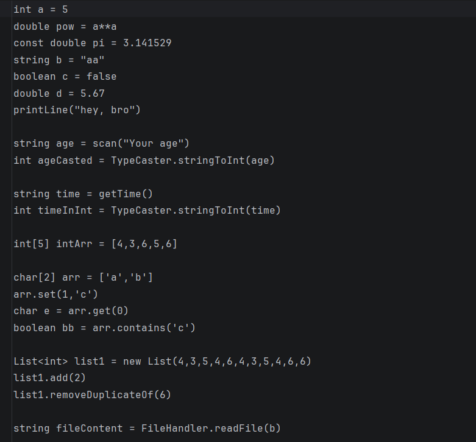
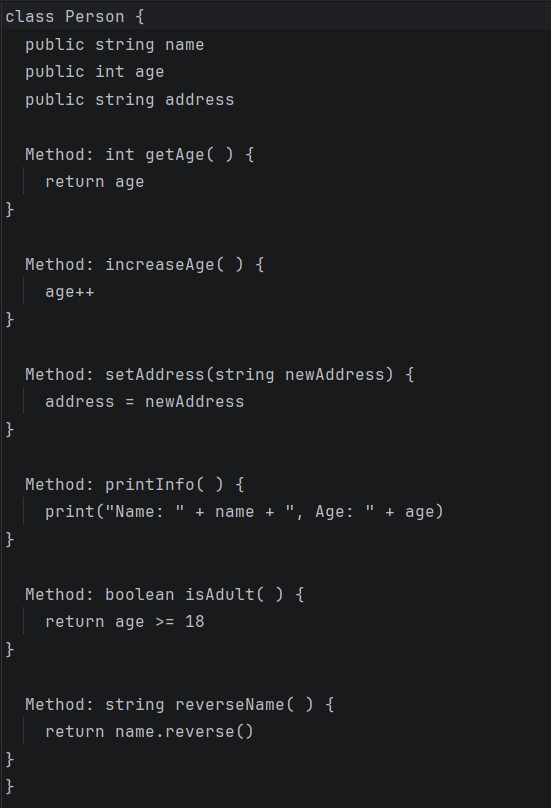

# Marsik

An experimental Programming language 

## Philosophy

- No complicated syntax like c++
- No out of control overhead like python
- Simple and powerful like python
- Intuitive as possible

## Features
- Primitives Types: int, babyint, double, char, boolean, string (pretends to be)
- Static standard libraries like Math, FileHandler, DateTime
- Variables, Constants, Operators, Control Flows, Primitive Arrays and build-in Datastructures
- Compiles from .marsik to .c and then with gcc to .exe

## What it does not have
- Try/Catch
- Pointers and Addresses like C/C++
- Fully developed OOP support with Constructors, Inheritance, Polymorphism, etc.
- Other nice features like Generics, Lambdas, etc.

## How to get started

1. Make sure you have **Java JDK 25** installed 
2. Make sure you have **gcc** installed and ready to use
3. Clone this repository  
4. In the compiler, make sure to set the correct paths according to your needs (for example, the path to the gcc executable)
5. Run the compiler and inspect the result.
Spoiler: the generated C file(s) looks like salad 🥗 and it does not compile :(

## What comes next

- Finished OOP support
- Fixing C codegeneration until GCC can compile it without errors (could take a while)
- Fixing more errors

## Code samples

## Current Tasks
- Support including variables in scan statement, same as in print statement
- Optional: printLine
- int cast for babyint in std::cout
- get the char[] out of the string when using it in std::cout
- random number generator
- hash function

## Who is Marsik?

You can find the answer in the picture below:

 

